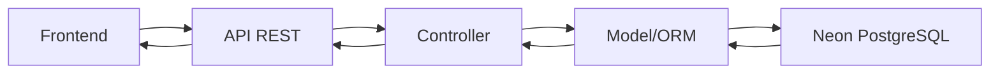
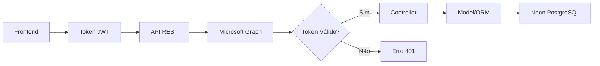

# API PythonPet - Backend


API RESTful desenvolvida em Python/Flask para o Portal do Projeto de Extensão de Engenharia Química da Universidade Federal de Uberlândia (PET-EQ). Esta API serve como backend para gerenciamento de membros, atividades, notícias e processos seletivos do grupo PET.

## 📋 Sobre o Projeto

Esta API surge da necessidade de modernizar e centralizar o gerenciamento de dados do grupo PET-EQ. O sistema permite:

- **Gestão Centralizada**: Controle unificado de todas as informações do grupo
- **Autenticação Segura**: Integração com Microsoft Graph para autenticação de administradores
- **API RESTful**: Endpoints bem estruturados seguindo padrões REST
- **Documentação Automática**: Swagger/OpenAPI integrado para documentação interativa
- **Banco de Dados Moderno**: Utiliza Neon PostgreSQL para alta disponibilidade
- **Arquitetura Escalável**: Estrutura modular facilitando manutenção e expansão

## 🚀 Principais Funcionalidades

### 📊 Gestão de Dados
- **Integrantes**: CRUD completo para membros ativos e inativos
- **Setores**: Organização por áreas (Computação, Ata, Marketing, Orientador)
- **Notícias**: Sistema de publicação com categorização
- **Atividades**: Gerenciamento de extensão, pesquisa e ensino
- **Processo Seletivo**: Controle de editais e resultados
- **Calendário**: Eventos e atividades programadas

### 🔒 Segurança e Autenticação
- **JWT Tokens**: Autenticação segura com tokens
- **Microsoft Graph**: Integração para validação de usuários
- **CORS Configurado**: Acesso controlado para domínios específicos
- **Validação de Dados**: DTOs para entrada e saída de dados

### 📚 Documentação e Testes
- **Swagger UI**: Documentação interativa em `/api/docs/`
- **Endpoints Organizados**: Estrutura clara por módulos
- **Logs Detalhados**: Sistema de logging para debugging

## 🛠️ Instalação e Configuração

### Pré-requisitos

1. **Python 3.9+**
   ```bash
   python --version  # Verifique se é 3.9 ou superior
   ```

2. **Git** (para clonagem do repositório)

3. **Conta Neon PostgreSQL** (ou PostgreSQL local)

### Instalação

1. **Clone o Repositório**
   ```bash
   git clone https://github.com/Mosfet04/PythonPet.git
   cd PythonPet
   ```

2. **Criar Ambiente Virtual**
   ```bash
   # Windows
   python -m venv venv
   venv\Scripts\activate
   
   # Linux/Mac
   python3 -m venv venv
   source venv/bin/activate
   ```

3. **Instalar Dependências**
   ```bash
   pip install -r requirements.txt
   ```

4. **Configurar Variáveis de Ambiente**
   
   Copie o arquivo `.env.example` para `.env`:
   ```bash
   copy .env.example .env  # Windows
   cp .env.example .env    # Linux/Mac
   ```
   
   Configure suas credenciais no arquivo `.env`:
   ```env
   # Configurações do banco Neon PostgreSQL
   DB_NAME=seu_banco_de_dados
   DB_USER=seu_usuario
   DB_PASSWORD=sua_senha
   DB_HOST=ep-xxxxxxxx-xxxxxxxx.us-east-1.aws.neon.tech
   DB_PORT=5432
   DB_SSL=true
   ```

5. **Configurar Banco Neon PostgreSQL**
   
   a. Acesse [Neon.tech](https://neon.tech) e crie uma conta
   
   b. Crie um novo projeto/banco de dados
   
   c. Copie as credenciais do dashboard para o arquivo `.env`
   
   d. Teste a conexão:
   ```bash
   python test_neon_connection.py
   ```

6. **Executar a Aplicação**
   ```bash
   python main.py
   ```

## 📁 Estrutura do Projeto

```
PythonPet/
│
├── 📂 controllers/           # Controladores das rotas
│   ├── CalendarioAtividadesController.py
│   ├── ExtensaoController.py
│   ├── IntegranteController.py
│   ├── MiniCursosController.py
│   ├── NoticiaController.py
│   ├── PesquisaController.py
│   ├── PlanejamentoRelatorioController.py
│   └── ProcessoSeletivoController.py
│
├── 📂 dtos/                  # Data Transfer Objects
│   ├── 📂 enums/            # Enumerações
│   ├── 📂 requests/         # DTOs de entrada
│   └── 📂 responses/        # DTOs de saída
│
├── 📂 facade/               # Camada de facades (blueprints)
│   ├── CalendarioAtividadesFacade.py
│   ├── ExtensaoFacade.py
│   ├── IntegrantesFacade.py
│   ├── MiniCursosFacade.py
│   ├── NoticiasFacade.py
│   ├── PesquisaFacade.py
│   ├── PlanejamentoRelatorioFacade.py
│   └── ProcessoSeletivoFacade.py
│
├── 📂 models/               # Modelos do banco de dados
│   ├── CalendarioAtividadesModel.py
│   ├── ExtensaoModel.py
│   ├── IntegranteModel.py
│   ├── JorneqModel.py
│   ├── MiniCursosModel.py
│   ├── NoticiasModel.py
│   ├── PesquisaModel.py
│   ├── PlanejamentoRelatorioModel.py
│   ├── ProcessoSeletivoModel.py
│   └── SetorModel.py
│
├── 📂 servicos/             # Serviços e utilitários
│   ├── microsoftGraph.py   # Integração Microsoft Graph
│   └── postegre.py         # Configuração do banco
│
├── 📂 Utils/                # Utilitários gerais
│   └── Util.py
│
├── 📄 config.py             # Configurações gerais
├── 📄 main.py               # Ponto de entrada da aplicação
├── 📄 requirements.txt      # Dependências Python
├── 📄 .env.example          # Exemplo de variáveis de ambiente
├── 📄 test_neon_connection.py  # Teste de conexão com Neon
└── 📄 diagnose_neon.py      # Diagnóstico do banco
```

## 🌐 Endpoints da API

### Base URL
```
http://localhost:5000/api
```

### Documentação Interativa
Acesse a documentação Swagger em: `http://localhost:5000/api/docs/`

### Principais Endpoints

#### 👥 Integrantes
- `GET /api/integrantes` - Lista todos os integrantes
- `GET /api/integrantes/{id}` - Busca integrante por ID
- `POST /api/integrantes` - Cria novo integrante
- `PUT /api/integrantes/{id}` - Atualiza integrante
- `DELETE /api/integrantes/{id}` - Remove integrante

#### 📰 Notícias
- `GET /api/noticias` - Lista todas as notícias
- `GET /api/noticias/categoria/{categoria}` - Filtra por categoria
- `POST /api/noticias` - Cria nova notícia
- `PUT /api/noticias/{id}` - Atualiza notícia
- `DELETE /api/noticias/{id}` - Remove notícia

#### 🎓 Extensão
- `GET /api/extensao` - Lista atividades de extensão
- `POST /api/extensao` - Cria atividade de extensão
- `PUT /api/extensao/{id}` - Atualiza atividade
- `DELETE /api/extensao/{id}` - Remove atividade

#### 🔬 Pesquisa
- `GET /api/pesquisa` - Lista atividades de pesquisa
- `POST /api/pesquisa` - Cria atividade de pesquisa
- `PUT /api/pesquisa/{id}` - Atualiza atividade
- `DELETE /api/pesquisa/{id}` - Remove atividade

#### 📚 Mini Cursos
- `GET /api/minicursos` - Lista mini cursos
- `POST /api/minicursos` - Cria mini curso
- `PUT /api/minicursos/{id}` - Atualiza mini curso
- `DELETE /api/minicursos/{id}` - Remove mini curso

#### 🎯 Processo Seletivo
- `GET /api/processo-seletivo` - Lista processos seletivos
- `POST /api/processo-seletivo` - Cria processo seletivo
- `PUT /api/processo-seletivo/{id}` - Atualiza processo
- `DELETE /api/processo-seletivo/{id}` - Remove processo

#### 📅 Calendário
- `GET /api/calendario` - Lista eventos do calendário
- `POST /api/calendario` - Cria evento
- `PUT /api/calendario/{id}` - Atualiza evento
- `DELETE /api/calendario/{id}` - Remove evento

## 🏗️ Arquitetura da Aplicação

### Padrão MVC Adaptado
```
Request → Facade → Controller → Model → Database
Response ← Facade ← Controller ← Model ← Database
```

### Camadas da Aplicação

1. **Facade Layer**: Blueprints Flask que organizam as rotas
2. **Controller Layer**: Lógica de negócio e validações
3. **Model Layer**: Representação dos dados e ORM
4. **Service Layer**: Serviços externos (Microsoft Graph, etc.)

### Fluxo de Dados

#### 📖 Busca de Dados Públicos


#### 🔐 Operações Autenticadas


## 🔧 Configuração para Desenvolvimento

### Ambiente de Desenvolvimento

1. **Debug Mode**: Já habilitado em `main.py`
2. **Hot Reload**: Flask reinicia automaticamente ao detectar mudanças
3. **CORS**: Configurado para aceitar requisições do frontend

### Testando Localmente

```bash
# Teste de conexão com banco
python test_neon_connection.py

# Diagnóstico completo
python diagnose_neon.py

# Executar aplicação
python main.py
```

### Variáveis de Ambiente para Desenvolvimento

```env
# .env para desenvolvimento local
DB_NAME=seu_banco_dev
DB_USER=dev_user
DB_PASSWORD=dev_password
DB_HOST=localhost  # ou host do Neon
DB_PORT=5432
DB_SSL=true

# Configurações opcionais
FLASK_ENV=development
FLASK_DEBUG=True
```

## 🐛 Resolução de Problemas

### Problemas Comuns

#### 1. Erro de Conexão com Neon
```
ERROR: unsupported startup parameter in options: search_path
```
**Solução**: Use conexão pooled padrão (já corrigido no código)

#### 2. Erro de SSL
```
connection failed: SSL required
```
**Solução**: Certifique-se que `DB_SSL=true` no arquivo `.env`

#### 3. Erro de Schema
```
no schema has been selected to create in
```
**Solução**: O código automaticamente define `search_path=public`

#### 4. Dependências não Encontradas
```
ModuleNotFoundError: No module named 'X'
```
**Solução**:
```bash
pip install -r requirements.txt
```

### Logs e Debugging

A aplicação produz logs detalhados no terminal. Procure por:
- ✅ Mensagens de sucesso (conexão, criação de tabelas)
- ⚠️ Avisos (configurações não ideais)
- ❌ Erros (problemas de conexão, dados inválidos)

## 📚 Dependências Principais

```python
# requirements.txt (principais)
Flask==3.0.3              # Framework web
peewee==3.17.6            # ORM para banco de dados
psycopg2-binary==2.9.9    # Driver PostgreSQL
flasgger==0.9.7.1         # Documentação Swagger
flask-cors==5.0.0         # CORS support
flask_jwt_extended==4.6.0 # JWT authentication
python-dotenv==1.0.1      # Variáveis de ambiente
requests==2.32.3          # HTTP requests
```

## 🚀 Deploy e Produção

### Para Azure App Service

1. Configure as variáveis de ambiente no portal Azure
2. Use o arquivo `requirements.txt` para instalação automática
3. Configure o comando de inicialização: `python main.py`

### Para Outras Plataformas

O código é compatível com:
- **Heroku**: Configure Procfile
- **Railway**: Deploy direto do GitHub
- **Render**: Configure build e start commands
- **DigitalOcean**: App Platform compatível

### Variáveis de Ambiente para Produção

```env
# Produção
DB_NAME=prod_database
DB_USER=prod_user
DB_PASSWORD=secure_password
DB_HOST=prod.neon.tech
DB_PORT=5432
DB_SSL=true
FLASK_ENV=production
```

## 🤝 Contribuindo

### Para Iniciantes

1. **Fork** o repositório
2. **Clone** sua fork
3. **Crie** uma branch para sua feature: `git checkout -b minha-feature`
4. **Faça** suas alterações
5. **Teste** localmente
6. **Commit**: `git commit -m "Adiciona nova feature"`
7. **Push**: `git push origin minha-feature`
8. **Abra** um Pull Request

### Padrões de Código

- Use **snake_case** para variáveis e funções
- Use **PascalCase** para classes
- Documente funções complexas
- Mantenha linhas com máximo 120 caracteres
- Use type hints quando possível

### Estrutura de Commits

```
tipo(escopo): descrição curta

Descrição mais detalhada se necessário

Fixes #123
```

Tipos: `feat`, `fix`, `docs`, `style`, `refactor`, `test`, `chore`

## 📄 Licença

Este projeto está licenciado sob a licença MIT. Veja o arquivo [LICENSE](LICENSE) para detalhes.

## 👥 Equipe de Desenvolvimento

- **Desenvolvedor Principal**: Mateus Meireles Ribeiro (mateusmr4@gmail.com)
- **Grupo PET-EQ**: Universidade Federal de Uberlândia

## 📞 Suporte

Para dúvidas e suporte:

1. **Issues**: Abra uma issue no GitHub
2. **Email**: mateusmr4@gmail.com
3. **Documentação**: `/api/docs/` (Swagger)

## 🔗 Links Úteis

- [Documentação Flask](https://flask.palletsprojects.com/)
- [Peewee ORM Docs](http://docs.peewee-orm.com/)
- [Neon PostgreSQL](https://neon.tech/docs)
- [Microsoft Graph API](https://docs.microsoft.com/graph/)
- [Frontend do Projeto](https://github.com/usuario/frontend-pet-eq)

---

Desenvolvido com ❤️ pelo grupo PET-EQ da Universidade Federal de Uberlândia
