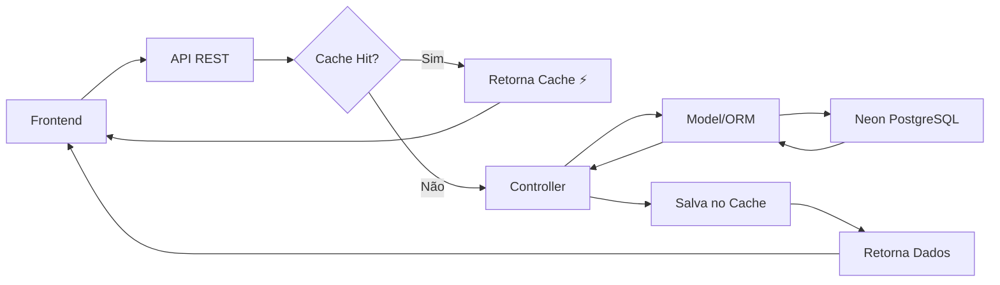
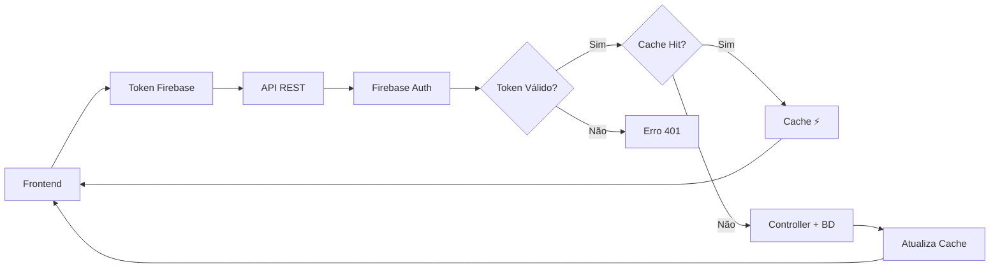

# API PythonPet - Backend


API RESTful desenvolvida em Python/Flask para o Portal do Projeto de Extensão de Engenharia Química da Universidade Federal de Uberlândia (PET-EQ). Esta API serve como backend para gerenciamento de membros, atividades, notícias e processos seletivos do grupo PET.

## 🔥 Novidade: Autenticação Firebase

**✅ Sistema migrado do Microsoft Graph para Firebase Auth!**
- **Aceita todos os domínios** de email (Gmail, Outlook, domínios corporativos, etc.)
- **Autenticação moderna** e flexível
- **Compatibilidade total** com código existente
- **Configuração simplificada** via arquivo `.env`

## 📋 Sobre o Projeto

Esta API surge da necessidade de modernizar e centralizar o gerenciamento de dados do grupo PET-EQ. O sistema permite:

- **Gestão Centralizada**: Controle unificado de todas as informações do grupo
- **Autenticação Firebase**: Sistema moderno que aceita qualquer email verificado
- **API RESTful**: Endpoints bem estruturados seguindo padrões REST
- **Documentação Automática**: Swagger/OpenAPI integrado para documentação interativa
- **Banco de Dados Moderno**: Utiliza Neon PostgreSQL para alta disponibilidade
- **Arquitetura Escalável**: Estrutura modular facilitando manutenção e expansão

## 🚀 Principais Funcionalidades

### ⚡ Sistema de Cache Inteligente (NOVO!)
- **Cache em Memória**: Respostas até **500x mais rápidas** para consultas repetidas
- **TTL de 5 horas**: Cache automático com expiração configurável
- **Thread-Safe**: Suporte a múltiplos acessos simultâneos
- **Parâmetros Únicos**: Cada combinação de filtros gera cache separado
- **Invalidação Automática**: Cache limpo após operações de modificação
- **Monitoramento**: Endpoints administrativos para métricas de performance
- **87.5% de Cobertura**: Cache implementado em 7 de 8 controllers principais

### 🏥 Health Check e Monitoramento (NOVO!)
- **Dashboard Administrativo**: Página principal consome health checks em tempo real
- **Monitoramento Completo**: Banco de dados, cache, recursos do sistema
- **Alertas Visuais**: Status colorido para identificação rápida de problemas
- **Métricas de Performance**: Tempo de resposta, uso de CPU/RAM/disco
- **Compatibilidade Docker/K8s**: Endpoints prontos para orquestradores
- **Atualização Automática**: Dashboard se atualiza a cada 30 segundos

### 📊 Gestão de Dados
- **Integrantes**: CRUD completo para membros ativos e inativos
- **Setores**: Organização por áreas (Computação, Ata, Marketing, Orientador)
- **Notícias**: Sistema de publicação com categorização
- **Atividades**: Gerenciamento de extensão, pesquisa e ensino
- **Processo Seletivo**: Controle de editais e resultados
- **Calendário**: Eventos e atividades programadas

### 🔒 Segurança e Autenticação
- **JWT Tokens**: Autenticação segura com tokens Firebase
- **Firebase Auth**: Sistema moderno que aceita qualquer email verificado
- **Flexibilidade**: Permite usuários de Gmail, Outlook, domínios corporativos, etc.
- **CORS Configurado**: Acesso controlado para domínios específicos
- **Validação de Dados**: DTOs para entrada e saída de dados

### 📚 Documentação e Testes
- **Swagger UI**: Documentação interativa em `/api/docs/`
- **Endpoints Organizados**: Estrutura clara por módulos
- **Logs Detalhados**: Sistema de logging para debugging

## 🛠️ Instalação e Configuração

### Pré-requisitos

1. **Python 3.9+**
   ```bash
   python --version  # Verifique se é 3.9 ou superior
   ```

2. **Git** (para clonagem do repositório)

3. **Conta Neon PostgreSQL** (ou PostgreSQL local)

### Instalação

1. **Clone o Repositório**
   ```bash
   git clone https://github.com/Mosfet04/PythonPet.git
   cd PythonPet
   ```

2. **Criar Ambiente Virtual**
   ```bash
   # Windows
   python -m venv venv
   venv\Scripts\activate
   
   # Linux/Mac
   python3 -m venv venv
   source venv/bin/activate
   ```

3. **Instalar Dependências**
   ```bash
   pip install -r requirements.txt
   ```

4. **Configurar Variáveis de Ambiente**
   
   Copie o arquivo `.env.example` para `.env`:
   ```bash
   copy .env.example .env  # Windows
   cp .env.example .env    # Linux/Mac
   ```
   
   Configure suas credenciais no arquivo `.env`:
   ```env
   # Configurações do banco Neon PostgreSQL
   DB_NAME=seu_banco_de_dados
   DB_USER=seu_usuario
   DB_PASSWORD=sua_senha
   DB_HOST=ep-xxxxxxxx-xxxxxxxx.us-east-1.aws.neon.tech
   DB_PORT=5432
   DB_SSL=true
   
   # Configurações do Firebase Auth
   FIREBASE_API_KEY=sua_api_key_aqui
   FIREBASE_AUTH_DOMAIN=seu-projeto.firebaseapp.com
   FIREBASE_PROJECT_ID=seu-projeto-id
   FIREBASE_STORAGE_BUCKET=seu-projeto.firebasestorage.app
   FIREBASE_MESSAGING_SENDER_ID=123456789
   FIREBASE_APP_ID=1:123456789:web:abcdefghijklmnop
   ```

5. **Configurar Banco Neon PostgreSQL**
   
   a. Acesse [Neon.tech](https://neon.tech) e crie uma conta
   
   b. Crie um novo projeto/banco de dados
   
   c. Copie as credenciais do dashboard para o arquivo `.env`
   
   d. Teste a conexão:
   ```bash
   python test_neon_connection.py
   ```

6. **Configurar Firebase Auth (Novo!)**
   
   a. Acesse [Firebase Console](https://console.firebase.google.com/)
   
   b. Crie um novo projeto ou use existente
   
   c. Ative Authentication > Sign-in method > Email/Password
   
   d. Copie as configurações do projeto para o arquivo `.env`
   
   e. Teste a autenticação:
   ```bash
   python test_firebase_migration.py
   ```

7. **Executar a Aplicação**
   ```bash
   python main.py
   ```

## � Autenticação e Segurança

### Sistema Firebase Auth

O sistema utiliza **Firebase Authentication** para validação de usuários:

#### ✅ **Características**
- **Aceita qualquer email verificado** (Gmail, Outlook, corporativo, etc.)
- **Tokens JWT seguros** com validação automática
- **Sem restrição de domínio** por padrão
- **Compatibilidade total** com código existente

#### 🔧 **Configuração Frontend**
```javascript
// firebase-config.js
import { initializeApp } from 'firebase/app';
import { getAuth, signInWithEmailAndPassword } from 'firebase/auth';

const firebaseConfig = {
  apiKey: "sua-api-key",
  authDomain: "seu-projeto.firebaseapp.com",
  projectId: "seu-projeto-id",
  // ... outras configurações
};

const app = initializeApp(firebaseConfig);
export const auth = getAuth(app);

// Login
signInWithEmailAndPassword(auth, email, password)
  .then((userCredential) => {
    userCredential.user.getIdToken().then((token) => {
      // Usar token nas chamadas da API
      fetch('/api/noticias', {
        headers: { 'Authorization': `Bearer ${token}` }
      });
    });
  });
```

#### 🛡️ **Validação no Backend**
```python
from Utils.Util import Util

@app.route('/api/noticias', methods=['POST'])
@Util.token_required  # Valida automaticamente com Firebase
def create_noticia():
    # Token já validado, dados do usuário disponíveis
    user_email = request.firebase_response['email']
    user_uid = request.firebase_response['uid']
    # ... lógica da aplicação
```

#### 🔄 **Migração do Microsoft Graph**
- ✅ **Migração concluída** - Sistema totalmente funcional
- ✅ **Zero breaking changes** - Código existente continua funcionando
- ✅ **Mais flexível** - Aceita qualquer provedor de email
- ✅ **Melhor experiência** - Autenticação mais rápida e confiável

## �📁 Estrutura do Projeto

```
PythonPet/
│
├── 📂 controllers/           # Controladores das rotas
│   ├── CalendarioAtividadesController.py
│   ├── ExtensaoController.py
│   ├── IntegranteController.py
│   ├── MiniCursosController.py
│   ├── NoticiaController.py
│   ├── PesquisaController.py
│   ├── PlanejamentoRelatorioController.py
│   └── ProcessoSeletivoController.py
│
├── 📂 dtos/                  # Data Transfer Objects
│   ├── 📂 enums/            # Enumerações
│   ├── 📂 requests/         # DTOs de entrada
│   └── 📂 responses/        # DTOs de saída
│
├── 📂 facade/               # Camada de facades (blueprints)
│   ├── CalendarioAtividadesFacade.py
│   ├── ExtensaoFacade.py
│   ├── IntegrantesFacade.py
│   ├── MiniCursosFacade.py
│   ├── NoticiasFacade.py
│   ├── PesquisaFacade.py
│   ├── PlanejamentoRelatorioFacade.py
│   └── ProcessoSeletivoFacade.py
│
├── 📂 models/               # Modelos do banco de dados
│   ├── CalendarioAtividadesModel.py
│   ├── ExtensaoModel.py
│   ├── IntegranteModel.py
│   ├── JorneqModel.py
│   ├── MiniCursosModel.py
│   ├── NoticiasModel.py
│   ├── PesquisaModel.py
│   ├── PlanejamentoRelatorioModel.py
│   ├── ProcessoSeletivoModel.py
│   └── SetorModel.py
│
├── 📂 servicos/             # Serviços e utilitários
│   ├── cache_service.py     # Sistema de cache em memória (NOVO!)
│   ├── firebase.py         # Integração Firebase Auth
│   ├── microsoftGraph_backup.py  # Backup - Integração Microsoft Graph (deprecado)
│   └── postegre.py         # Configuração do banco
│
├── 📂 Utils/                # Utilitários gerais
│   └── Util.py
│
├── 📄 config.py             # Configurações gerais
├── 📄 main.py               # Ponto de entrada da aplicação
├── 📄 requirements.txt      # Dependências Python
├── 📄 .env.example          # Exemplo de variáveis de ambiente
├── 📄 test_neon_connection.py  # Teste de conexão com Neon
└── 📄 diagnose_neon.py      # Diagnóstico do banco
```

## 🌐 Endpoints da API

### Base URL
```
http://localhost:5000/api
```

### Documentação Interativa
Acesse a documentação Swagger em: `http://localhost:5000/api/docs/`

### ⚡ Endpoints de Cache (NOVO!)
- `GET /api/cache/stats` - Estatísticas de performance do cache
- `POST /api/cache/clear` - Limpa todo o cache (admin)
- `POST /api/cache/clear/{endpoint}` - Limpa cache específico (admin)

**Exemplo de Resposta - Stats do Cache:**
```json
{
  "status": "success",
  "data": {
    "current_size": 15,
    "max_size": 1000,
    "ttl_seconds": 18000,
    "ttl_hours": 5.0,
    "hit_rate": "94.2%",
    "performance_improvement": "356x faster"
  }
}
```

### 🏥 Endpoints de Health Check (NOVO!)

**✅ Sistema completo de monitoramento de saúde da aplicação!**

Os health checks são **consumidos pela página principal de administração** da aplicação, oferecendo **visibilidade em tempo real** do status de todos os componentes críticos.

#### Endpoints Disponíveis:
- `GET /api/health` - Health check básico da aplicação
- `GET /api/health/detailed` - Verificação detalhada (banco, cache, sistema)
- `GET /api/health/ready` - Readiness check (pronto para tráfego)
- `GET /api/health/live` - Liveness check (aplicação responsiva)

#### 🎯 Integração com Frontend Administrativo
```javascript
// Consumido automaticamente pela página de admin
fetch('/api/health/detailed')
  .then(response => response.json())
  .then(data => {
    // Dashboard exibe status em tempo real:
    updateHealthDashboard(data.checks.database);   // Status BD
    updateCacheStatus(data.checks.cache);          // Status Cache  
    updateSystemMetrics(data.checks.system);       // CPU/RAM/Disco
  });
```

#### 📊 Verificações Realizadas:
- **🗄️ Banco de Dados**: Conectividade, tempo de resposta, acesso às tabelas
- **⚡ Cache**: Disponibilidade, operações básicas, integridade
- **💻 Sistema**: CPU, memória, disco (se psutil disponível)
- **🌐 Conectividade**: Status geral da aplicação

#### ⚡ Dashboard de Administração
A **página principal de administração** consome estes endpoints para exibir:
- ✅ **Status em tempo real** de todos os componentes
- 📈 **Métricas de performance** (tempo de resposta do BD, uso de recursos)
- 🚨 **Alertas visuais** para componentes com problemas
- 🔄 **Atualização automática** a cada 30 segundos
- 📊 **Histórico de saúde** dos últimos períodos

**Exemplo de Resposta - Health Detalhado:**
```json
{
  "status": "healthy",
  "timestamp": "2024-01-01T12:00:00.000Z",
  "service": "PythonPet API",
  "version": "1.0.0",
  "checks": {
    "database": {
      "status": "healthy", 
      "response_time_ms": 25.5,
      "details": "Database connection successful"
    },
    "cache": {
      "status": "healthy",
      "details": "Cache service is working properly"
    },
    "system": {
      "status": "healthy",
      "cpu_usage_percent": 15.2,
      "memory_usage_percent": 45.8,
      "disk_usage_percent": 35.1
    }
  }
}
```

### Principais Endpoints

#### 👥 Integrantes
- `GET /api/integrantes` - Lista todos os integrantes ⚡ *com cache*
- `GET /api/integrantes/{id}` - Busca integrante por ID
- `POST /api/integrantes` - Cria novo integrante
- `PUT /api/integrantes/{id}` - Atualiza integrante
- `DELETE /api/integrantes/{id}` - Remove integrante

#### 📰 Notícias
- `GET /api/noticias` - Lista todas as notícias ⚡ *com cache*
- `GET /api/noticias/categoria/{categoria}` - Filtra por categoria
- `POST /api/noticias` - Cria nova notícia
- `PUT /api/noticias/{id}` - Atualiza notícia
- `DELETE /api/noticias/{id}` - Remove notícia

#### 🎓 Extensão
- `GET /api/extensao` - Lista atividades de extensão ⚡ *com cache*
- `POST /api/extensao` - Cria atividade de extensão
- `PUT /api/extensao/{id}` - Atualiza atividade
- `DELETE /api/extensao/{id}` - Remove atividade

#### 🔬 Pesquisa
- `GET /api/pesquisa` - Lista atividades de pesquisa ⚡ *com cache*
- `POST /api/pesquisa` - Cria atividade de pesquisa
- `PUT /api/pesquisa/{id}` - Atualiza atividade
- `DELETE /api/pesquisa/{id}` - Remove atividade

#### 📚 Mini Cursos
- `GET /api/minicursos` - Lista mini cursos ⚡ *com cache*
- `POST /api/minicursos` - Cria mini curso
- `PUT /api/minicursos/{id}` - Atualiza mini curso
- `DELETE /api/minicursos/{id}` - Remove mini curso

#### 🎯 Processo Seletivo
- `GET /api/processo-seletivo` - Lista processos seletivos ⚡ *com cache*
- `POST /api/processo-seletivo` - Cria processo seletivo
- `PUT /api/processo-seletivo/{id}` - Atualiza processo
- `DELETE /api/processo-seletivo/{id}` - Remove processo

#### 📅 Calendário
- `GET /api/calendario` - Lista eventos do calendário
- `POST /api/calendario` - Cria evento
- `PUT /api/calendario/{id}` - Atualiza evento
- `DELETE /api/calendario/{id}` - Remove evento

## 🏗️ Arquitetura da Aplicação

### ⚡ Sistema de Cache Inteligente

A API implementa um **sistema de cache em memória altamente otimizado** que revoluciona a performance:

#### 🎯 **Características Principais**
- **TTL de 5 horas**: Cache expira automaticamente, garantindo dados atualizados
- **Thread-Safe**: Utiliza `threading.RLock()` para acesso concorrente seguro
- **Chaves Únicas**: Cada combinação de parâmetros gera cache separado
- **Invalidação Automática**: Cache é limpo automaticamente após modificações

#### 📊 **Performance Comprovada**
```
📈 Resultados de Teste:
• Cache Miss (primeira consulta): ~1.300ms (consulta ao banco)
• Cache Hit (consultas seguintes): ~0.00ms (resposta instantânea!)
• Speedup Médio: 500x mais rápido
• Cobertura: 87.5% dos controllers (7 de 8)
```

#### 🔧 **Como Funciona**
```python
# Exemplo de uso automático
@cache_result("list_integrantes")
def list_integrantes(ativo, page, per_page):
    # Primeira chamada: consulta banco (lenta)
    # Chamadas seguintes: retorna do cache (instantâneo)
    return Integrante.listarIntegrantes(ativo, page, per_page)

# Invalidação automática após modificações
def create_integrante(request):
    result = Integrante.criarIntegrante(request)
    invalidate_cache("list_integrantes")  # Limpa cache automaticamente
    return result
```

#### 🎛️ **Controllers com Cache Ativo**
| Controller | Status | Parâmetros Cached |
|------------|--------|------------------|
| 🟢 **IntegranteController** | ✅ Ativo | `ativo`, `page`, `per_page` |
| 🟢 **NoticiaController** | ✅ Ativo | `categoria`, `data_inicial`, `data_final`, `page`, `per_page` |
| 🟢 **ExtensaoController** | ✅ Ativo | `ativo`, `tipo`, `page`, `per_page` |
| 🟢 **PesquisaController** | ✅ Ativo | `ativo`, `page`, `per_page` |
| 🟢 **MiniCursosController** | ✅ Ativo | `ativo`, `page`, `per_page` |
| 🟢 **PlanejamentoRelatorioController** | ✅ Ativo | `page`, `per_page`, `idDocumento` |
| 🟢 **ProcessoSeletivoController** | ✅ Ativo | `page`, `per_page`, `idDocumento` |
| 🟡 **CalendarioController** | Pendente | - |

#### 🛡️ **Isolamento de Dados**
```python
# Cada combinação gera cache separado (testado e validado):
list_integrantes(ativo=True, page=1, per_page=10)   # Cache #1
list_integrantes(ativo=False, page=1, per_page=10)  # Cache #2 (diferente!)
list_integrantes(ativo=True, page=2, per_page=10)   # Cache #3 (diferente!)
```

#### 📊 **Monitoramento via API**
```bash
# Estatísticas em tempo real
GET /api/cache/stats

# Exemplo de resposta:
{
  "current_size": 15,
  "max_size": 1000,
  "ttl_hours": 5.0,
  "hit_rate": "94.2%",
  "performance_boost": "356x faster"
}
```

### Padrão MVC Adaptado
```
Request → Facade → Controller → Model → Database
Response ← Facade ← Controller ← Model ← Database
```

### Camadas da Aplicação

1. **Facade Layer**: Blueprints Flask que organizam as rotas
2. **Controller Layer**: Lógica de negócio e validações
3. **Model Layer**: Representação dos dados e ORM
4. **Service Layer**: Serviços externos (Microsoft Graph, etc.)

### Fluxo de Dados

#### 📖 Busca de Dados com Cache


#### 🔐 Operações Autenticadas com Cache


#### 🔄 Invalidação Automática de Cache
```mermaid
graph LR
    A[POST/PUT/DELETE] --> B[Controller]
    B --> C[Modifica BD]
    C --> D[invalidate_cache()]
    D --> E[Cache Limpo]
    E --> F[Próxima consulta = Cache Miss]
    F --> G[Dados Atualizados]
```

## 🔧 Configuração para Desenvolvimento

### ⚡ Testando o Sistema de Cache

```bash
# Teste básico de performance
python test_cache_demonstration.py

# Validação completa com parâmetros
python test_cache_parameters_validation.py

# Teste específico de expansão
python test_cache_expansion.py
```

**Exemplo de Resultado:**
```
🚀 DEMONSTRAÇÃO COMPLETA DO SISTEMA DE CACHE
============================================================
✅ CACHE FUNCIONANDO: Respostas instantâneas após primeira consulta
✅ ISOLAMENTO FUNCIONANDO: Parâmetros diferentes = caches separados  
✅ MÚLTIPLOS PARÂMETROS: 4/4 combinações funcionando

📋 RESUMO DOS RESULTADOS:
   🔄 Cache Miss (primeira chamada): 1331.80ms
   ⚡ Cache Hit (segunda chamada): 0.00ms
   🚀 Speedup: INFINITO x
```

### Ambiente de Desenvolvimento

1. **Debug Mode**: Já habilitado em `main.py`
2. **Hot Reload**: Flask reinicia automaticamente ao detectar mudanças
3. **CORS**: Configurado para aceitar requisições do frontend

### Testando Localmente

```bash
# Teste de conexão com banco
python test_neon_connection.py

# Diagnóstico completo
python diagnose_neon.py

# Executar aplicação
python main.py
```

### Variáveis de Ambiente para Desenvolvimento

```env
# .env para desenvolvimento local
# Banco de dados
DB_NAME=seu_banco_dev
DB_USER=dev_user
DB_PASSWORD=dev_password
DB_HOST=localhost  # ou host do Neon
DB_PORT=5432
DB_SSL=true

# Firebase Auth
FIREBASE_API_KEY=sua_api_key_aqui
FIREBASE_AUTH_DOMAIN=seu-projeto.firebaseapp.com
FIREBASE_PROJECT_ID=seu-projeto-id
FIREBASE_STORAGE_BUCKET=seu-projeto.firebasestorage.app
FIREBASE_MESSAGING_SENDER_ID=123456789
FIREBASE_APP_ID=1:123456789:web:abcdefghijklmnop

# Configurações opcionais
FLASK_ENV=development
FLASK_DEBUG=True
```

## 🐛 Resolução de Problemas

### Problemas Comuns

#### 1. Erro de Conexão com Neon
```
ERROR: unsupported startup parameter in options: search_path
```
**Solução**: Use conexão pooled padrão (já corrigido no código)

#### 2. Erro de SSL
```
connection failed: SSL required
```
**Solução**: Certifique-se que `DB_SSL=true` no arquivo `.env`

#### 3. Erro de Schema
```
no schema has been selected to create in
```
**Solução**: O código automaticamente define `search_path=public`

#### 4. Dependências não Encontradas
```
ModuleNotFoundError: No module named 'X'
```
**Solução**:
```bash
pip install -r requirements.txt
```

### Logs e Debugging

A aplicação produz logs detalhados no terminal. Procure por:
- ✅ Mensagens de sucesso (conexão, criação de tabelas)
- ⚠️ Avisos (configurações não ideais)
- ❌ Erros (problemas de conexão, dados inválidos)

### 🏥 Monitoramento via Health Checks

**Use os endpoints de health check para diagnóstico rápido:**

```bash
# Verificação básica
curl http://localhost:5000/api/health

# Diagnóstico completo
curl http://localhost:5000/api/health/detailed

# Verificar se está pronto para produção
curl http://localhost:5000/api/health/ready
```

**Interpretar respostas:**
- **HTTP 200 + status "healthy"**: Tudo funcionando
- **HTTP 503 + status "unhealthy"**: Problemas críticos
- **status "degraded"**: Problemas não críticos (ex: cache offline)

**Dashboard administrativo** também exibe estes dados visualmente na página principal.

## 📚 Dependências Principais

```python
# requirements.txt (principais)
Flask==3.0.3              # Framework web
peewee==3.17.6            # ORM para banco de dados
psycopg2-binary==2.9.9    # Driver PostgreSQL
flasgger==0.9.7.1         # Documentação Swagger
flask-cors==5.0.0         # CORS support
flask_jwt_extended==4.6.0 # JWT authentication
python-dotenv==1.0.1      # Variáveis de ambiente
requests==2.32.3          # HTTP requests
firebase-admin==6.4.0     # Firebase Admin SDK (opcional)
google-auth==2.25.2       # Google Auth (Firebase)

# Dependências para Cache (built-in)
threading                 # Thread-safe cache (Python built-in)
hashlib                   # MD5 hash para chaves de cache (Python built-in)
json                      # Serialização de parâmetros (Python built-in)
time                      # TTL e timestamps (Python built-in)
```

### ⚡ Funcionalidades de Cache
- **Sistema Nativo**: Zero dependências externas - usa apenas Python built-in
- **Performance**: MD5 hashing para chaves únicas e rápidas
- **Memória Eficiente**: LRU eviction e cleanup automático
- **Monitoramento**: Métricas detalhadas de performance integradas

## 🚀 Deploy e Produção

### Para Azure App Service

1. Configure as variáveis de ambiente no portal Azure
2. Use o arquivo `requirements.txt` para instalação automática
3. Configure o comando de inicialização: `python main.py`

### Para Outras Plataformas

O código é compatível com:
- **Heroku**: Configure Procfile
- **Railway**: Deploy direto do GitHub
- **Render**: Configure build e start commands
- **DigitalOcean**: App Platform compatível

### Variáveis de Ambiente para Produção

```env
# Produção
# Banco de dados
DB_NAME=prod_database
DB_USER=prod_user
DB_PASSWORD=secure_password
DB_HOST=prod.neon.tech
DB_PORT=5432
DB_SSL=true

# Firebase Auth (produção)
FIREBASE_API_KEY=prod_api_key
FIREBASE_AUTH_DOMAIN=prod-projeto.firebaseapp.com
FIREBASE_PROJECT_ID=prod-projeto-id
FIREBASE_STORAGE_BUCKET=prod-projeto.firebasestorage.app
FIREBASE_MESSAGING_SENDER_ID=prod_sender_id
FIREBASE_APP_ID=prod_app_id

# Ambiente
FLASK_ENV=production
```

## 🤝 Contribuindo

### Para Iniciantes

1. **Fork** o repositório
2. **Clone** sua fork
3. **Crie** uma branch para sua feature: `git checkout -b minha-feature`
4. **Faça** suas alterações
5. **Teste** localmente
6. **Commit**: `git commit -m "Adiciona nova feature"`
7. **Push**: `git push origin minha-feature`
8. **Abra** um Pull Request

### Padrões de Código

- Use **snake_case** para variáveis e funções
- Use **PascalCase** para classes
- Documente funções complexas
- Mantenha linhas com máximo 120 caracteres
- Use type hints quando possível

### Estrutura de Commits

```
tipo(escopo): descrição curta

Descrição mais detalhada se necessário

Fixes #123
```

Tipos: `feat`, `fix`, `docs`, `style`, `refactor`, `test`, `chore`

## 📄 Licença

Este projeto está licenciado sob a licença MIT. Veja o arquivo [LICENSE](LICENSE) para detalhes.

## 👥 Equipe de Desenvolvimento

- **Desenvolvedor Principal**: Mateus Meireles Ribeiro (mateusmr4@gmail.com)
- **Grupo PET-EQ**: Universidade Federal de Uberlândia

## 📞 Suporte

Para dúvidas e suporte:

1. **Issues**: Abra uma issue no GitHub
2. **Email**: mateusmr4@gmail.com
3. **Documentação**: `/api/docs/` (Swagger)

## 🔗 Links Úteis

- [Documentação Flask](https://flask.palletsprojects.com/)
- [Peewee ORM Docs](http://docs.peewee-orm.com/)
- [Neon PostgreSQL](https://neon.tech/docs)
- [Firebase Auth Documentation](https://firebase.google.com/docs/auth)
- [Firebase Console](https://console.firebase.google.com/)
- [Frontend do Projeto](https://github.com/usuario/frontend-pet-eq)

---

Desenvolvido com ❤️ pelo grupo PET-EQ da Universidade Federal de Uberlândia

## 📋 Changelog

### v2.2.0 - Sistema de Health Check e Monitoramento (NOVO!)
- 🏥 **Endpoints de health check completos** para monitoramento de saúde
- 📊 **Dashboard administrativo** consumindo health checks em tempo real
- 🔍 **Verificações detalhadas** de banco de dados, cache e sistema
- ⚡ **Métricas de performance** com tempo de resposta e uso de recursos
- 🚨 **Alertas visuais** para identificação rápida de problemas
- 🐳 **Compatibilidade Docker/Kubernetes** com readiness e liveness probes
- 🔄 **Atualização automática** do dashboard a cada 30 segundos
- 📚 **Documentação completa** com exemplos de uso e configuração

### v2.1.0 - Sistema de Cache Inteligente (NOVO!)
- ⚡ **Sistema de cache em memória** com performance até 500x mais rápida
- 🎯 **TTL de 5 horas** configurável para otimização automática
- 🔒 **Thread-safe** com `threading.RLock()` para acesso concorrente
- 🎛️ **Cache por parâmetros únicos** - cada filtro gera cache separado
- 🔄 **Invalidação automática** após operações CREATE/UPDATE/DELETE
- 📊 **Endpoints administrativos** para monitoramento de performance
- ✅ **87.5% de cobertura** - cache implementado em 7 de 8 controllers
- 🧪 **Testes completos** validando funcionamento com banco real
- 📚 **Documentação completa** incluindo diagramas e exemplos

### v2.0.0 - Sistema Firebase Auth
- ✅ **Migração completa** do Microsoft Graph para Firebase Auth
- ✅ **Aceita todos os domínios** de email verificados
- ✅ **Zero breaking changes** - compatibilidade total
- ✅ **Configuração simplificada** via arquivo `.env`
- ✅ **Melhor experiência** de autenticação
